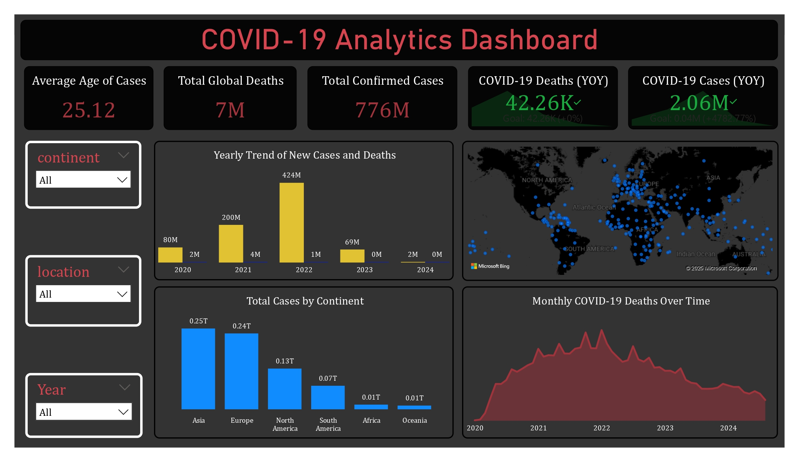

# Covid-19 Analysis Project

This project is part of the NTI Graduation Project.  
It includes data analysis and visualization of Covid-19 using **Power BI** and other tools.

---

## 📊 Dashboard Preview

Here’s a snapshot of the dashboard created for this project:



---

## 📂 Project Structure
- **Dashboard/** → Contains dashboard reports and images.
- **power bi visualization/** → Power BI `.pbix` file for interactive analysis.
- Other scripts and files for data analysis.

---

## 🚀 How to Use
1. Clone this repository:
   ```bash
   git clone https://github.com/khalidabdelrazek/Covid-19-Analysis.git
